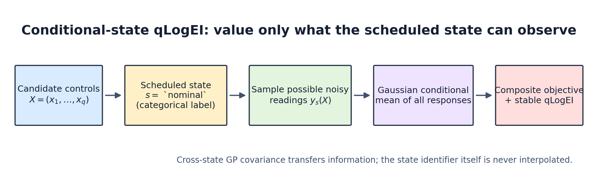
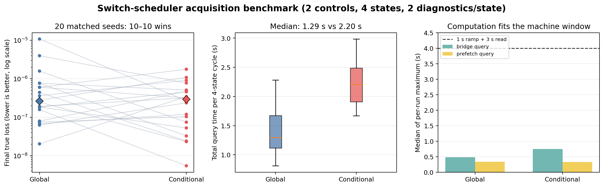

# Conditional-state qLogEI in msBO

## What the name means

msBO uses **conditional-state qLogEI** (abbreviated **CS-qLogEI**) when
`step_batch_with_switch()` must choose controls that will be measured in one
already-scheduled machine state.

The state is categorical.  Labels such as `nominal`, `low_85pct`, and
`high_115pct` identify distinct configurations; they are never interpreted as
continuous numbers between which msBO interpolates.  Internally, a task ID
identifies each `(state, diagnostic)` pair.  Correlations between those tasks
are learned by the multi-task GP.

At controls \(x\) and categorical state \(s\), distinguish:

- \(f_s(x)\): the latent, noise-free beam-response vector under state \(s\);
- \(y_s(x)=f_s(x)+\epsilon_s\): the averaged diagnostic reading returned by
  the machine.

“Latent” describes the unobserved beam response, not a fractional state label.



## Calculation

For a proposed batch \(X=(x_1,\ldots,x_q)\), let \(A\) denote all
state-diagnostic tasks and let \(O_s\) denote the tasks observable in scheduled
state \(s\).  The fitted GP supplies

\[
\begin{bmatrix} f_A(X) \\ y_{O_s}(X) \end{bmatrix}
\sim \mathcal N\!\left(
\begin{bmatrix}\mu_A\\\mu_{O_s}\end{bmatrix},
\begin{bmatrix}
\Sigma_{AA} & \Sigma_{A,O_s}\\
\Sigma_{O_s,A} & \Sigma_{O_s,O_s}+R_s
\end{bmatrix}\right),
\]

where \(R_s\) is the observation-noise covariance.  For every Monte Carlo draw
\(y_{O_s}^{(r)}\), msBO computes the standard Gaussian conditional mean

\[
m_A^{(r)} = \mu_A + \Sigma_{A,O_s}
(\Sigma_{O_s,O_s}+R_s)^{-1}
(y_{O_s}^{(r)}-\mu_{O_s}).
\]

It evaluates the multi-state composite objective \(g\) on the updated mean at
each batch point and applies the numerically stable qLogEI reductions:

\[
\alpha_{\mathrm{CS-qLogEI}}(X,s)
= \log\,\mathbb E_r\!\left[
\max_{i=1,\ldots,q}\{g(m_A^{(r)}(x_i))-f^*,0\}
\right],
\]

with smooth log-domain approximations for the positive part and maximum.  The
implementation uses the predictive variance of the *noisy averaged reading* in
the inverse.  Conditioning on \(\Sigma_{O_s,O_s}\) alone would overstate how
much an imperfect reading teaches the model.

With learned homoskedastic noise, \(R_s\) is the fitted likelihood variance.
If the dataset supplies a different fixed variance for every past reading, the
future reading's variance is not yet known; msBO uses the mean training
variance for each requested diagnostic task.

## Relation to existing methods

I did not find a canonical published acquisition with this exact formula and
the name “Conditional EI.”  The name in msBO is therefore project-specific.
Its ingredients are established:

1. the update is ordinary Gaussian/GP conditioning [Rasmussen and Williams,
   2006](https://gaussianprocess.org/gpml/chapters/);
2. applying EI after a multi-output response is mapped through a nonlinear
   objective is closely related to expected improvement for composite
   functions [Astudillo and Frazier,
   2019](https://proceedings.mlr.press/v97/astudillo19a.html);
3. the log-domain stabilization follows LogEI [Ament et al.,
   2023](https://proceedings.neurips.cc/paper_files/paper/2023/hash/419f72cbd568ad62183f8132a3605a2a-Abstract-Conference.html).

CS-qLogEI can also be viewed as a restricted, same-batch-location approximation
to value-of-information methods.  Full knowledge gradient evaluates how a
hypothetical observation changes the best posterior decision over the complete
control domain [Frazier, Powell, and Dayanik,
2009](https://pubsonline.informs.org/doi/10.1287/ijoc.1080.0314).  Recent
partial-evaluation BO also uses knowledge gradient to decide which components
to observe [Buathong et al.,
2024](https://proceedings.mlr.press/v235/buathong24a.html).  CS-qLogEI does not
perform that inner global re-optimization and does not build fantasy GP models.

## What it does and does not value

- It values only information obtainable in the scheduled categorical state.
- Learned cross-task covariance lets that observation update beliefs about beam
  responses under the other states.
- For a joint batch, all scheduled-state observations condition all proposed
  locations, so within-batch spatial correlation is retained.
- Same-state pending points may be included.  A pending observation from a
  different state is deliberately omitted because its observation block and
  noise model differ.
- Improvement is tested at the proposed batch locations.  The method does not
  search the entire domain after each hypothetical reading, so it is not full
  look-ahead or knowledge gradient.

For \(q\) points, CS-qLogEI samples and solves an observable block of size
\(qJ\), but it still obtains cross-covariance to all \(qSJ\) latent beam
responses.  It avoids fantasy-model construction and refitting; whether it is
faster than global qLogEI depends on the model, batch size, and implementation.

## API and default

`step_batch_with_switch()` now defaults to CS-qLogEI:

```python
msbo.step_batch_with_switch(s=current, next_s=incoming, q=3)
```

The explicit alternatives are:

```python
acq_state_mode="conditional"  # default for step_batch_with_switch
acq_state_mode="global"       # ordinary global qLogEI
acq_state_mode="mean"         # legacy scheduled-state sample + mean fill
```

Conditional mode currently supports EI/LogEI acquisitions. If a switch run
explicitly requests UCB or KG, it must also select a compatible `"global"` or
legacy `"mean"` state mode.

For backward compatibility, explicit `fix_acq_state=False` selects `"global"`
and explicit `fix_acq_state=True` selects legacy `"mean"`.  Omit the old boolean
when using the new default or pass `acq_state_mode` explicitly.

## Current benchmark evidence

The matched benchmark uses 20 seeds, two controls, four states, two diagnostics
per state, and the real concurrent switch scheduler.  With the corrected
noise-aware update:

- conditional beat global on 10/20 matched seeds (two-sided sign test
  \(p=1.0\));
- the paired median objective difference favored conditional by
  \(5.16\times10^{-8}\), but the Wilcoxon signed-rank test was not significant
  (\(p=0.62\));
- median total acquisition-query time was 2.20 s for conditional and 1.29 s for
  global on this CPU run;
- the maximum computation intended to overlap a 4 s ramp-plus-reading window
  remained below that window in every run;
- neither mode produced `BadInitialCandidatesWarning`.

These results support feasibility during switching, not a universal claim of
better optimization quality.  The default is motivated by observation
semantics: it values what the scheduled state can actually reveal.  Keep global
qLogEI as a benchmark and reconsider the default if representative machine or
digital-twin tests favor it.



Reproduce the data and plot with:

```powershell
python examples/benchmark_switch_acquisition_modes.py --seeds 20 --modes global conditional --output examples/benchmark/switch_acquisition_modes_20seeds_noiseaware.csv
python examples/plot_conditional_state_qlogei.py
```
